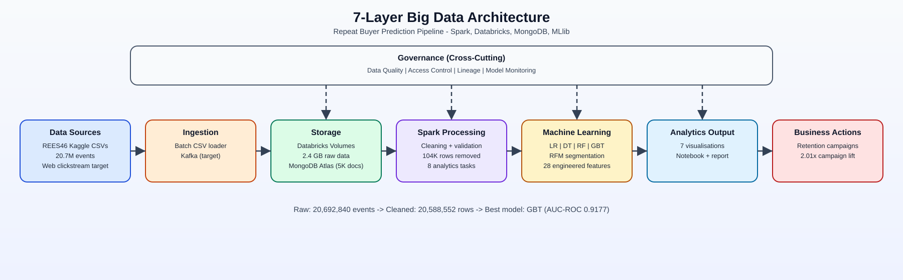
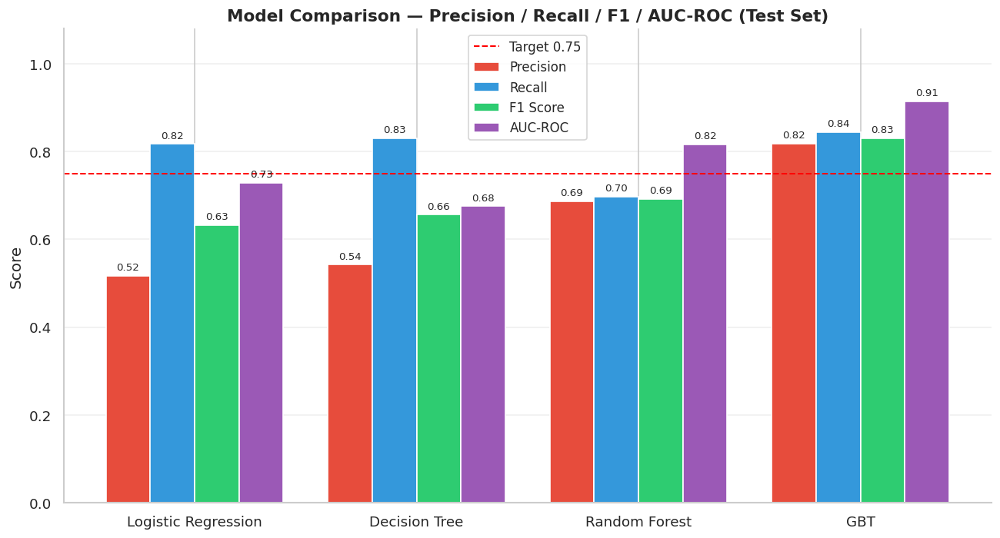
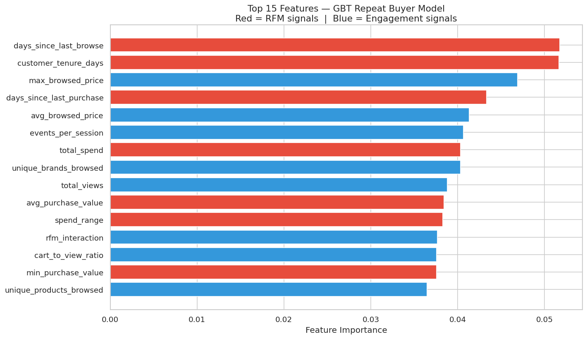
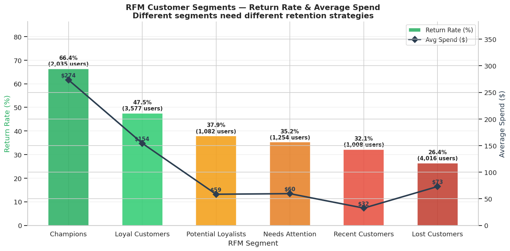

<h1 align="center">🛍️ Repeat Buyer Prediction in E-Commerce Using Apache Spark &amp; MLlib</h1>

<p align="center"><strong>End-to-end big data pipeline · 20.7M events · PySpark + Databricks · GBT AUC-ROC 0.9177</strong></p>

<p align="center">
  
  
  
  
</p>

| 📦 20.7M Events | 🎯 AUC-ROC 0.9177 | 📈 1.96x Campaign Lift | 🧠 28 Features |
|:--:|:--:|:--:|:--:|

## 🔍 Overview

This project predicts repeat buyers in e-commerce using Spark MLlib on **20,692,840** clickstream events from the REES46 dataset. It combines data engineering, model selection, and RFM segmentation to deliver actionable customer targeting.

The workflow uses a leakage-safe temporal split (**Oct-Dec features -> Jan-Feb labels**) and benchmarks LR, DT, RF, GBT, plus a weighted ensemble. Final outputs are model metrics, feature importance, segment strategy, and campaign actions.

This was a group project where I led a team of 4 members across data engineering, modeling, and presentation delivery.

## 💼 Business Impact

> 💡 **The Bottom Line:** We achieved a **1.96x campaign lift**. Targeting the top GBT-scored 5,426 users reaches approximately **4,334 returners**, compared to just **2,211** using random baseline targeting.

| 📊 Impact Metric | Value | 🎯 Why It Matters |
|---|---:|---|
| **Campaign lift** | `1.96x` | Nearly doubles the yield of retention campaigns. |
| **Targeted users** | `~5,426` | Identifies the optimal high-priority campaign cohort. |
| **Expected returners** (model) | `~4,334` | Strong conversion probability from the ranking model. |
| **Precision@5%** | `0.971` | Near-certain returners, perfect for VIP actions/perks. |
| **Cart abandonment rate** | `84.18%` | Highlights the highest-impact quick win for automated emails. |

## 🛠️ Tech Stack

| Layer | Tools | Version | Purpose |
|---|---|---|---|
| 🧮 **Processing** |  | 3.5+ | Distributed ETL and analytics |
| 🤖 **Machine Learning**|  | - | Binary classification models |
| ☁️ **Compute** |  | Serverless | Managed pipeline execution |
| 🌉 **Workspace Bridge**|  | 15.1.0 | Local VS Code integration |
| 🍃 **NoSQL Demo** |  | 8.0 | Document storage sample |
| 📈 **Visualization** |   | 3.x | Charts and tabular formatting |

## 🏗️ Architecture

<p align="center">
  
</p>

| Layer | Role |
|---|---|
| Data Sources | Historical CSV + production clickstream target |
| Ingestion | Batch loader (implemented) + Kafka path (target) |
| Storage | Databricks Volumes + MongoDB Atlas sample |
| Processing | Cleaning + descriptive analytics |
| Machine Learning | MLlib classifiers + RFM segmentation |
| Output | Visual diagnostics and report artifacts |
| Business Actions | Retention and lifecycle targeting |

## ⚙️ Prerequisites

Before running the pipeline locally or on Databricks, ensure you have the following:

- **Java Runtime**: Java 8 or 11 required for local PySpark execution.
- **Python**: Python 3.9+ with pip.
- **Databricks Account**: A Databricks workspace (Premium recommended for Serverless features, though Standard works for standard clusters).
- **Databricks CLI**: Installed and configured (databricks configure) for executing bundles or Databricks Connect.
- **MongoDB Atlas**: A free cluster with a valid connection string to run the NoSQL demo.

## 🚀 Quickstart

1. Clone repository:

```
git clone https://github.com/deaneeth/ecommerce-repeat-buyer-prediction.git
cd ecommerce-repeat-buyer-prediction
```

2. Download Kaggle files using the Kaggle API (2019-Oct.csv, 2019-Nov.csv, 2019-Dec.csv, 2020-Jan.csv, 2020-Feb.csv):

```
kaggle datasets download -d mkechinov/ecommerce-events-history-in-cosmetics-shop
```

3. Upload files to dbfs:/Volumes/workspace/default/cosmetics_data/.
4. Set MongoDB Atlas credentials in src/MongoDB_Demo.py.
5. Install essentials:

```
pip install pyspark pandas matplotlib "pymongo[srv]"
```

6. Run pipeline:

```
python src/MongoDB_Demo.py
python src/Main_Analysis.py
```

## 🗂️ Dataset Overview & Quality

> 🛒 **Dataset:** [REES46 eCommerce Events History in Cosmetics Shop](https://www.kaggle.com/datasets/mkechinov/ecommerce-events-history-in-cosmetics-shop)
> 📦 **Volume:** 5 CSV files (~2.4 GB)
> 📅 **Date Range:** October 2019 to February 2020

### 🧹 Data Cleansing Metrics

| Metric | Count / Value |
|---|---:|
| **Raw Events** | `20,692,840` |
| **Cleaned Rows** | `20,588,552` |
| **Rows Removed** | `104,288` |
| **Removal Rate** | `0.50%` |
| **`category_code` Sparsity**| `~98% null` *(Flagged & retained)* |

### 🧬 Schema

| Field | Type | Description |
|---|---|---|
| `event_time` | `timestamp` | UTC Event timestamp |
| `event_type` | `string` | Interaction type (`view`, `cart`, `purchase`) |
| `product_id` | `long` | Unique product identifier |
| `category_id` | `long` | Unique category identifier |
| `category_code` | `string` | Hierarchical category path *(Highly sparse)* |
| `brand` | `string` | Product brand name |
| `price` | `double` | Product price |
| `user_id` | `long` | Unique customer identifier |
| `user_session` | `string` | Unique session UUID |

## 🔄 Pipeline Architecture

1. **Ingest:** Load monthly CSVs into Spark and unify into one distributed DataFrame.
2. **Cleanse:** Remove invalid rows, parse timestamps, and derive time features.
3. **Engineer:** Build customer-level features (RFM + engagement + interaction metrics).
4. **Split:** Segment data temporally to prevent data leakage.
5. **Train:** Benchmark LR, DT, RF, GBT, and tune thresholds to optimize the F1 score.
6. **Deploy:** Combine model prediction scores with RFM segments for actionable campaign targeting.

```python
# Key modeling setup
assembler = VectorAssembler(inputCols=feature_columns, outputCol="features", handleInvalid="skip")

gbt = GBTClassifier(
    featuresCol="features",
    labelCol="label",
    weightCol="class_weight",     # Balances the churn vs retained ratio
    maxIter=300,                  # Allows sufficient boosting rounds for convergence
    maxDepth=6,                   # Limits tree depth to prevent overfitting on specific user segments
    stepSize=0.05,                # Conservative learning rate to improve generalization
    subsamplingRate=0.8,          # Adds stochasticity to reduce variance
    featureSubsetStrategy="sqrt", # Randomly selects feature subsets per split (like Random Forest)
    minInstancesPerNode=3,        # Ensures leaf nodes have enough support
)
```

## 🧪 Model Results & Evaluation

| 🤖 Model | Precision | Recall | F1 Score | AUC-ROC |
|---|---:|---:|---:|---:|
| **Logistic Regression** | 0.5165 | 0.8170 | 0.6329 | 0.7281 |
| **Decision Tree** | 0.5424 | 0.8303 | 0.6561 | 0.6752 |
| **Random Forest** | 0.6870 | 0.6970 | 0.6919 | 0.8160 |
| **Weighted Ensemble** | 0.7929 | 0.8073 | 0.8000 | - |
| 🏆 **GBT (Best)** | **0.7988** | **0.8329** | **0.8155** | **0.9177** |

> 💡 **Interpretation:** An AUC-ROC of **0.9177** means the Gradient-Boosted Tree model correctly ranks a true returning customer above a non-returning customer approximately **91.77%** of the time.

| Model Comparison | Feature Importance (GBT) |
| :---: | :---: |
|  |  |

### Top 5 GBT Features

| Rank | Feature | Importance |
|---:|---|---:|
| 1 | customer_tenure_days | 0.0559 |
| 2 | days_since_last_browse | 0.0507 |
| 3 | max_browsed_price | 0.0445 |
| 4 | days_since_last_purchase | 0.0439 |
| 5 | avg_purchase_value | 0.0423 |

## 👥 RFM Customer Segmentation

| Segment | Users | Return Rate | Avg Spend | Action |
|---|---:|---:|---:|---|
| Champions | 2,035 | 66.4% | $273.50 | VIP early access |
| Loyal Customers | 3,577 | 47.5% | $125.25 | Upsell premium products |
| Potential Loyalists | 1,082 | 37.9% | $265.52 | Engagement campaigns |
| Needs Attention | 1,254 | 35.2% | $300.60 | Win-back discounts |
| Recent Customers | 1,008 | 32.1% | $230.46 | Onboarding sequences |
| Lost Customers | 4,016 | 26.4% | $15.03 | Deep discount / deprioritise |

<p align="center">
  
</p>

## 🔧 Engineering Challenges & Fixes

| Challenge | Symptom | Fix |
|---|---|---|
| StandardScaler on SparseVectors | MLlib crash with withMean=True | Set withMean=False |
| Month ordering in charts | Alphabetical order | Sort by yyyy-MM key |
| VectorAssembler with nulls | NullPointerException | handleInvalid="skip" |
| UTC-suffix timestamp parsing | Parse failures | Custom timestamp parsing logic |
| MongoDB SRV connection | Atlas connection failures | Install pymongo[srv] |
| DataFrame continuity across notebooks | Session/key issues | Consolidated into 2 Python scripts |

## 📁 Repository Structure

```
ecommerce-repeat-buyer-prediction/
├── README.md
├── databricks.yml
├── pyproject.toml
├── src/
│   ├── Main_Analysis.py
│   └── MongoDB_Demo.py
├── Notebooks/
│   ├── Main_Analysis.ipynb
│   └── MongoDB_Demo.ipynb
├── dataset/
└── assets/
```

## 🔮 Future Enhancements

While this pipeline successfully identifies high-value returners in batch, future iterations could include:
* **Real-time Inference:** Replacing the batch ingestion with Apache Kafka for real-time clickstream scoring.
* **A/B Testing Framework:** Implementing a feedback loop to measure the actual conversion lift of the GBT-targeted campaigns against the baseline.
* **Deep Learning:** Exploring sequential models (like LSTMs) on the `user_session` sequences to capture more nuanced browsing patterns.

> **Note:** The MongoDB demo is a standalone script to illustrate NoSQL integration and is not part of the main Spark pipeline.

## ☕ Support

<p align="center">
  <a href="https://www.buymeacoffee.com/deaneeeth1" target="_blank" rel="noreferrer">
    
  </a>
</p>

<p align="center"><strong>Made with love by Dean.</strong></p>

## 📧 Author / Contact

- **Name:** Dineth Hettiarachchi
- **GitHub:** [@deaneeth](https://github.com/deaneeth)
- **LinkedIn:** [Dineth Hettiarachchi](https://linkedin.com/in/deaneeth)
- **Email:** [dnethusahan.h05@gmail.com](mailto:dnethusahan.h05@gmail.com)

---

<p align="center">
  <strong>Built as a team-led big data project focused on measurable retention impact.</strong>
</p>

<p align="center">
  
  
  
</p>

<p align="center"><strong>⭐ If this project helped you, a star would mean a lot.</strong></p>
