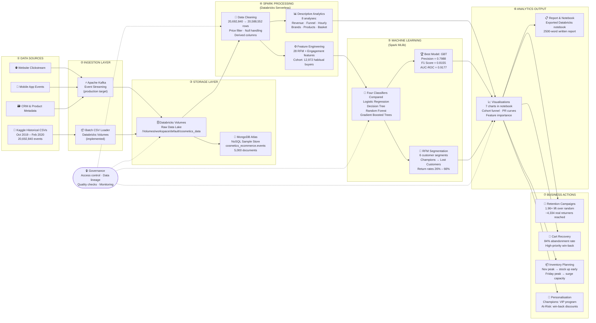

# Phase 6: Big Data Architecture Diagram Guide (Step 6)

## Purpose

This document gives a complete, evidence-based blueprint for the Step 6 architecture diagram.
It is built from validated outputs in Phases 1–5 and is designed to be used as:

1. A ready-to-paste Mermaid code block for online renderers (mermaid.live, draw.io, Gamma).
2. A step-by-step Draw.io manual construction guide.
3. A report-ready reference for writing component explanations.

---

## Evidence Baseline From Completed Phases

Use these numbers as callouts in the diagram — they prove traceability to real outputs.

| Area | Validated Value | Source Phase |
| --- | --- | --- |
| Raw events loaded | 20,692,840 rows (5 months) | Phase 1 |
| Cleaned events | 20,588,552 rows | Phase 3 |
| Rows removed in cleaning | 104,288 (0.50%) | Phase 3 |
| Total revenue | $6,351,830.29 | Phase 3 |
| Session conversion rate | 3.44% purchase sessions | Phase 3 |
| Cart abandonment rate | 84.18% | Phase 3 |
| MongoDB sample storage | 5,000 docs in cosmetics_ecommerce.events | Phase 2 |
| ML cohort (habitual buyers) | 12,972 users (purchased on ≥2 distinct days) | Phase 5 |
| Best classifier | GBT — Precision=0.7988, F1=0.8155, AUC-ROC=0.9177 | Phase 5 |
| Campaign lift | 1.96× over random targeting | Phase 5 |
| RFM segmentation | 6 segments: Champions (66.4%) → Lost Customers (26.4%) | Phase 5 |

---

## Scope: Implemented vs. Target Architecture

Show both paths explicitly — this demonstrates enterprise thinking.

| Path | What it is |
| --- | --- |
| **Implemented (production)** | Batch CSV ingestion → Databricks Volumes → Spark cleaning + analytics + ML |
| **Production target** | Kafka streaming from website/app/CRM → same Spark/Databricks core at scale |

---

## Option A — Mermaid Code (Paste into mermaid.live or draw.io)

Go to **https://mermaid.live**, paste the block below, then export as PNG/SVG.



---

## Option B — Draw.io Step-by-Step Manual Guide

### Step 1 — Set up the canvas

1. Open **https://app.diagrams.net** (Draw.io, free, no login needed).
2. Click **Extras → Edit Diagram** and paste the Mermaid code from Option A — Draw.io can import it directly.  
   OR build manually from Step 2 below.
3. Set page size: **File → Page Setup → A4 Landscape** (or 16:9 for presentation).

---

### Step 2 — Create 7 swimlane containers (left to right)

Use **Insert → Container** or draw a rectangle for each layer. Label each:

| # | Label | Fill Colour (hex) | Contents |
|---|---|---|---|
| 1 | DATA SOURCES | `#D5E8D4` (light green) | 4 boxes: Website · Mobile · CRM · Kaggle CSVs |
| 2 | INGESTION | `#DAE8FC` (light blue) | 2 boxes: Kafka (dashed border) · Batch CSV Loader |
| 3 | STORAGE | `#FFE6CC` (light orange) | 2 boxes: Databricks Volumes · MongoDB Atlas |
| 4 | SPARK PROCESSING | `#E1D5E7` (light purple) | 3 boxes: Cleaning · Descriptive Analytics · Feature Engineering |
| 5 | MACHINE LEARNING | `#FFF2CC` (light yellow) | 3 boxes: 4 Classifiers · GBT Best Model · RFM Segments |
| 6 | ANALYTICS OUTPUT | `#F8CECC` (light red/pink) | 2 boxes: Visualisations · Report & Notebook |
| 7 | BUSINESS ACTIONS | `#D5E8D4` (light green) | 4 boxes: Retention · Cart Recovery · Inventory · Personalisation |

Place **GOVERNANCE** as a rounded rectangle spanning the top or bottom of layers 3–6.

---

### Step 3 — Add boxes inside each swimlane

Copy these labels exactly (include the metric callout on a second line):

**Layer 1 — Data Sources**
- Website Clickstream
- Mobile App Events
- CRM & Product Metadata
- Kaggle Historical CSVs *(sub-label: Oct 2019–Feb 2020 · 20,692,840 events)*

**Layer 2 — Ingestion**
- Apache Kafka — Event Streaming *(sub-label: production target · dashed border)*
- Batch CSV Loader *(sub-label: production implementation · Databricks Volumes)*

**Layer 3 — Storage**
- Databricks Volumes — Raw Data Lake *(sub-label: /Volumes/workspace/default/cosmetics_data)*
- MongoDB Atlas — NoSQL Store *(sub-label: cosmetics_ecommerce.events · 5,000 documents)*

**Layer 4 — Spark Processing (Databricks Serverless)**
- Data Cleaning *(sub-label: 20,692,840 → 20,588,552 rows · price filter · null handling)*
- Descriptive Analytics *(sub-label: 8 analyses · revenue · funnel · hourly · brands)*
- Feature Engineering *(sub-label: 28 RFM + Engagement features · 12,972-user cohort)*

**Layer 5 — Machine Learning (Spark MLlib)**
- Four Classifiers Compared *(sub-label: LR · DT · Random Forest · GBT)*
- Best Model: GBT *(sub-label: Precision=0.7988 · F1=0.8155 · AUC-ROC=0.9177)*
- RFM Segmentation *(sub-label: 6 segments · Champions 66.4% → Lost 26.4% return rate)*

**Layer 6 — Analytics Output**
- Visualisations *(sub-label: 7 charts · cohort funnel · PR curves · feature importance)*
- Report & Notebook *(sub-label: exported Databricks notebook · 2500-word report)*

**Layer 7 — Business Actions**
- Retention Campaigns *(sub-label: 1.96× lift · ~4,334 real returners reached per campaign)*
- Cart Recovery *(sub-label: 84% abandonment rate · automated email trigger)*
- Inventory Planning *(sub-label: Nov peak · Friday high-conversion window)*
- Personalisation *(sub-label: Champions VIP · At-Risk win-back discounts)*

---

### Step 4 — Draw arrows

**Solid arrows** (primary data flow) — use Draw.io default arrow style:
- All 4 sources → Ingestion boxes
- Both ingestion boxes → Databricks Volumes
- Databricks Volumes → MongoDB Atlas
- Databricks Volumes → Data Cleaning
- Data Cleaning → Descriptive Analytics
- Data Cleaning → Feature Engineering
- Descriptive Analytics → Visualisations
- Feature Engineering → Four Classifiers
- Four Classifiers → GBT Best Model
- Four Classifiers → RFM Segmentation
- GBT Best Model → Visualisations
- RFM Segmentation → Visualisations
- Visualisations → Report & Notebook
- Visualisations → all 4 Business Action boxes

**Dashed arrows** (governance) — right-click arrow → Edit Style → add `dashed=1`:
- Governance → Databricks Volumes
- Governance → Data Cleaning
- Governance → Four Classifiers
- Governance → Visualisations

---

### Step 5 — Add metric callout boxes (mandatory)

Add 3–4 floating annotation boxes (yellow sticky note style — Draw.io shape: **Note**) near the relevant layer:

| Callout text | Place near |
| --- | --- |
| `Input: 20,692,840 events · 5 months` | Layer 1 |
| `Cleaned: 20,588,552 rows (99.5% retained)` | Layer 4 / Cleaning box |
| `Revenue: $6,351,830 · Nov 2019 peak` | Layer 4 / Analytics box |
| `GBT: P=0.7988 · F1=0.8155 · AUC=0.9177` | Layer 5 / Best Model box |
| `Lift: 1.96× over random · ~4,334 customers/campaign` | Layer 7 |

---

### Step 6 — Visual polish

- Font: **Helvetica** or **Arial**, size 10 for body, size 12 bold for layer headers
- Arrow colour: `#666666` for solid, `#999999` for dashed
- Box border radius: 6px (softer look)
- Add a **title box** at the top:  
  `Cosmetics E-Commerce Big Data Architecture`  
  `Batch + ML Analytics on Apache Spark / Databricks`
- Export: **File → Export As → PNG** at 200 DPI

---

## Option C — Canva / PowerPoint Quick Version

If Draw.io feels complex, use this simplified 5-box linear layout:

```
┌──────────────┐    ┌───────────────────┐    ┌──────────────────────┐
│ DATA SOURCES  │───▶│  INGESTION &       │───▶│  SPARK PROCESSING     │
│               │    │  STORAGE           │    │  (Databricks)         │
│ Kaggle CSVs   │    │                   │    │                      │
│ Website/App   │    │ Batch CSV Loader  │    │ Cleaning             │
│ CRM           │    │ Databricks Volumes│    │ 8 Analyses           │
│               │    │ MongoDB Atlas     │    │ 28-feature Eng.      │
│ 20.7M events  │    │ (5,000 docs)      │    │ 12,972-user cohort   │
└──────────────┘    └───────────────────┘    └──────────────────────┘
                                                         │
                                                         ▼
┌──────────────────────────────┐    ┌──────────────────────────────┐
│  MACHINE LEARNING             │    │  OUTPUT & BUSINESS ACTIONS    │
│  (Spark MLlib)                │    │                              │
│                              │    │ 7 Visualisations             │
│ LR · DT · RF · GBT compared  │───▶│ Retention Campaigns (1.96×)  │
│ Best: GBT                    │    │ Cart Recovery                │
│   Precision = 0.7988         │    │ Inventory Planning           │
│   F1 = 0.8155                │    │ Personalisation              │
│   AUC-ROC = 0.9177           │    │                              │
│ RFM: 6 segments              │    │ Written Report + Notebook    │
└──────────────────────────────┘    └──────────────────────────────┘
```

Recreate this in PowerPoint/Google Slides using rectangles + connectors. Takes ~20 minutes.

---

## Component Explanations (Report-Ready, 1–2 Sentences Each)

| Component | Explanation |
| --- | --- |
| **Data Sources** | User interactions from the website and mobile app generate raw clickstream events. Historical CSV exports from Kaggle (Oct 2019–Feb 2020, 20,692,840 events) are used for batch analysis and model development. |
| **Ingestion Layer** | Apache Kafka is the production-target ingestion mechanism for continuous event streaming from website, mobile, and CRM systems. For this production implementation, batch CSV loading from Databricks Volumes implements the equivalent ingestion function. |
| **Storage Layer** | Databricks Volumes store raw CSV event files for distributed Spark processing. MongoDB Atlas stores a 5,000-document JSON sample of the event data, demonstrating NoSQL schema flexibility for semi-structured records with high field sparsity (e.g., 98% missing category_code). |
| **Spark Processing Layer** | Apache Spark on Databricks Serverless performs cleaning, validation, and large-scale aggregation across 20.7M events. Eight descriptive analytics tasks are executed, including revenue analysis, conversion funnel measurement, and hourly/weekly behavioural patterns. |
| **Machine Learning Layer** | Spark MLlib trains four classification models (Logistic Regression, Decision Tree, Random Forest, GBT) on 28 RFM and engagement features extracted from a cohort of 12,972 habitual buyers. GBT is selected as the best model (Precision=0.7988, F1=0.8155, AUC-ROC=0.9177). RFM quintile scoring produces 6 customer segments for targeted retention. |
| **Analytics Output Layer** | Seven visualisations are produced in the notebook (cohort funnel, PR curves, feature importance, model comparison, confusion matrix, RFM segments, brand revenue). A written report documents all findings for non-technical stakeholders. |
| **Business Action Layer** | Model predictions power four concrete business actions: retention campaigns (1.96× lift, ~4,334 real customers reached per campaign), cart abandonment recovery (targeting the 84% abandonment rate), inventory optimisation (November peak, Friday high-conversion window), and personalised re-engagement (Champions VIP program, Lost Customers win-back). |
| **Governance** | Cross-cutting controls include data quality checks at ingestion, access control on Databricks Volumes, data lineage tracking across processing steps, and model monitoring for drift detection in production. |

---

## Mandatory Diagram Annotations (Must Appear Somewhere on the Diagram)

Include at least 5 of these as callout labels or sub-labels on the diagram:

1. `20,692,840 raw events · 5 months (Oct 2019–Feb 2020)`
2. `Cleaned: 20,588,552 rows · 104,288 removed (0.50%)`
3. `Revenue: $6,351,830 total · November 2019 peak`
4. `Session conversion: 3.44% · Cart abandonment: 84.18%`
5. `Cohort: 12,972 habitual buyers · 40.8% return base rate`
6. `GBT Best Model: Precision=0.7988 · F1=0.8155 · AUC-ROC=0.9177`
7. `Campaign lift: 1.96× over random targeting`
8. `MongoDB: 5,000 docs in cosmetics_ecommerce.events`

---

## Phase 6 Submission Checklist

- [ ] Architecture diagram exported as PNG or JPG (min 200 DPI)
- [ ] All 7 layers clearly labelled
- [ ] Both ingestion paths shown (Kafka + Batch CSV)
- [ ] MongoDB and Databricks Volumes both shown in Storage layer
- [ ] GBT model metrics annotated (P=0.7988, F1=0.8155, AUC=0.9177)
- [ ] At least 5 metric callouts from the Evidence Baseline table above
- [ ] Solid arrows for data flow, dashed for governance
- [ ] Component explanations (1–2 sentences each) included in report
- [ ] Diagram included in both the report AND the presentation video
